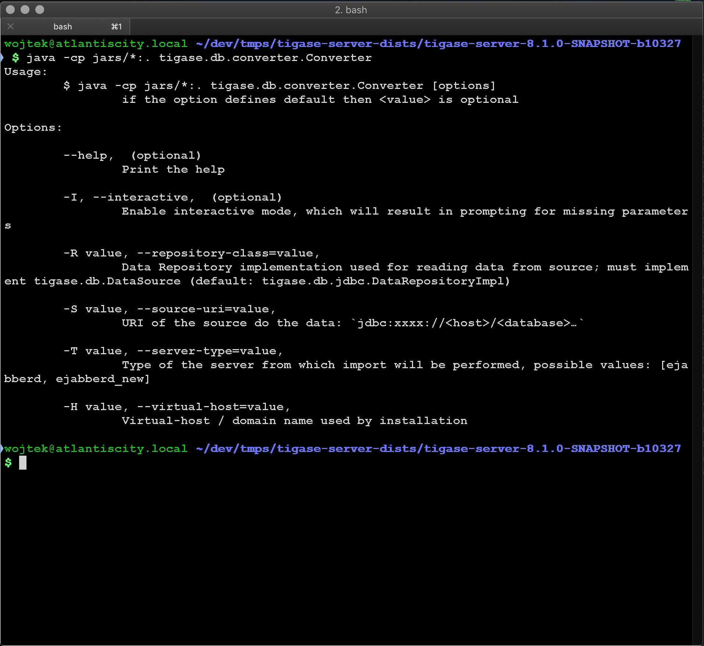

 /statusIcon)


# Tigase Database Migrator

Tigase Database Migrator is component allowing migration of different types of data from various XMPP servers.
Currently supports following servers and data:

* `ejabberd`
  * User data (authentication, roster)
  * MUC (multi user chat)
  * PubSub

# Usage

Migrator is a command-line utility. Main class: `tigase.db.converter.Converter`, if executed without any parameters will display help with all parameters explained:

```
$ java -cp jars/*:. tigase.db.converter.Converter [options]
```

## Converter options

Following options are supported

* `-I` or `--interactive` (*optional*) - Enable interactive mode, which will result in prompting for missing parameters
* `-R value` or `--repository-class=value` - allows specifying  `DataRepository` implementation used for reading data from source; must implement tigase.db.DataSource (default: `tigase.db.jdbc.DataRepositoryImpl`)
* `-S value` or `--source-uri=value` - URI of the source do the data: `jdbc:xxxx://<host>/<database>…`
* `-T value` or `--server-type=value` - type of the server from which import will be performed, possible values: [ejabberd, ejabberd_new]
* `-D value` or `--destination-uri=value` - URI of the destination for the data: `jdbc:xxxx://<host>/<database>…`
* `-C value` or `--components=value` (*optional*) - additional component beans names that should be activated
* `-H value` or  `--virtual-host=value` - allows specifying Virtual-host / domain name used by source installation (for example in case of old ejabberd installations)

# Support

When looking for support, please first search for answers to your question in the available online channels:

* Our online documentation: [Tigase Docs](https://docs.tigase.net/)
* Our online forums: [Tigase Forums](https://help.tigase.net/portal/community)
* Our online Knowledge Base [Tigase KB](https://help.tigase.net/portal/kb)

If you didn't find an answer in the resources above, feel free to submit your question to either our 
[community portal](https://help.tigase.net/portal/community) or open a [support ticket](https://help.tigase.net/portal/newticket).

https://docs.tigase.net/tigase-database-migrator/1.0.0/Tigase_Database_Migrator_Guide/html/

# Downloads

Migrator is included in every distribution of Tigase XMPP Server. Dedicated binaries can be downloaded from our [Maven repository](https://maven-repo.tigase.net/#artifact/tigase/tigase-database-migrator)

# Compilation 

It's a Maven project therefore after cloning the repository you can easily build it with:

```bash
mvn -Pdist clean install
```

# License

 This is official [Tigase](https://tigase.net/) Repository.
Copyright (c) 2013-2019 Tigase, Inc.

Licensed under AGPL License Version 3. Other licensing options available upon request.
